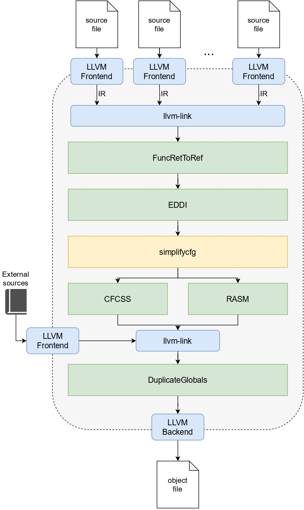

# ASPIS - Automatic Software-based Protection and Integrity Suite

ASPIS (from the ancient Greek Ἀσπίς Aspís, *shield*) is an out-of-tree plugin for LLVM that acts on the Intermediate-Representation (IR) in order to harden the code against Single-Event Upsets (SEUs). 

The hardening process is done by the sequence of passes depicted in the following figure:
<p align=center>

</p>

## Pre-requisites

The toolchain has been tested with the following versions:
- CMake 3.22.1
- LLVM 16.0.0

During the development of ASPIS, done mostly on LLVM 15, we discovered a bug in the [`splitBasicBlock()`](https://llvm.org/doxygen/classllvm_1_1BasicBlock.html#a2bc5caaabd6841e4ab97237ebcaeb86d) procedure. The bug has been fixed in LLVM 16, so we recommend using it rather than applying the patch to the previous versions. 

## Building

To build ASPIS, type the following commands:

```bash
mkdir build
cmake -B build -DLLVM_DIR=<your/llvm/dir>
cmake --build build
```

Where `your/llvm/dir` is the directory where LLVMConfig.cmake is found (check here [here](https://llvm.org/docs/CMake.html) for further information).

# Usage

In order to apply ASPIS, you can use the built-in compilation pipeline provided by the `aspis.sh` shell script, or you can make your own custom compilation pipeline using LLVM `opt`.

## Annotations

When compiling `C`/`C++`, it is possible to use clang annotations in the source to manually tell the compiler what to do with specific variables and/or functions. The syntax for the annotation is the following:

```C
__attribute__((annotate(<annotation>)))
```

The following describes the possibilities for `<annotation>`.

### The `to_harden` annotation

```C
__attribute__((annotate("to_harden")))
```

When a function is declared this way, ASPIS Recursively protects this resource.
If the annotation is applied to a function, all the function body is protected and recursively all the called functions are duplicated (for exception of the `exclude` functions).
If the annotation is applied to a variable, all its uses are protected:
- TBD


### The `to_duplicate` annotation

```C
__attribute__((annotate("to_duplicate")))
```

When a function is declared this way, ASPIS does not duplicate the function body, but duplicates the call to the function.

When a global variable outside the compilation unit is declared this way, ASPIS duplicates it.


### The `exclude` annotation

```C
__attribute__((annotate("exclude")))
```
ASPIS does not compile the annotated function or does not duplicate the annotated global variable.
All its content is not duplicated, for exception of the protected global variables (way to enter in the sphere of replication).

### General behaviour of REDDI

All aliases are "solved" (aliases substituted with aliasees).
All the `volatile` global variables are treated like `exclude` GV.

We mark the resources to protect with the `to_harden` annotation and the resources that shouldn't be protected with the `exclude` annotation. In the middle there is the grey-area, with the rest of resources that are not marked at all. 
First of all, recursively all the resources and their dependencies are protected, leading to an expansion of the sphere of replication.
The most critical and non trivial transformations are the ones in the edges of the two spheres: when we have to go from the protected part to the excluded part and vice-versa.
When all the duplication path is computed and protected, all the fixups will be done to generate coherent code, avoiding the call of malformed functions.

All uses of the `to_harden` global variables are duplicated (also in `exclude` and `to_duplicate` functions).
All the BB of the `to_harden` function are duplicated, along with all the used `to_harden` and grey-area functions. `to_duplicate` functions are called two times and `exclude` functions are called in their classic version.

Particular cases when calling a function:
- passing trivial variable by value
- passing trivial variable by reference
- passing trivial variable by pointer
- passing complex variable by value
- passing complex variable by reference
- passing complex variable by pointer
- passing function pointer: TBD (using two times the classic function?)


All cases when in different kind of functions:
- In `to_harden` functions:
    - all operations are duplicated for everything.
    - If call a `to_harden` function: Call the `_dup` version
    - If call a `to_duplicate` function: Call two times the classic version
    - If call a `exclude` function: Call the classic version [EXIT FROM SPHERE OF REPLICATION].
    - If call a grey-area funciton: Call the `_dup` version [EXPANSION OF SPHERE OF REPLICATION].
    - Return value: same but duplicated. Externally used just by the single return
- In `to_duplicate` functions:
    - all operations are duplicated for both the duplciated GV (Case 3).
    - If call a `to_harden` function: Create `_dup` version of the `to_duplicate` function with just the needed duplicated parameters.
    - If call a `to_duplicate` function: Call one time the function if the variable isn't duplicated.
    - If call a `exclude` function: Call one time the classic version
    - If call a grey-area funciton: Call the classic or `_original` version
    - Return value: just one
- In `exclude` functions:
    - all operations are duplicated for both the duplicated GV [or only the stores are duplicated?].
    - If call a `to_harden` function: Call the `_original` version
    - If call a `to_duplicate` function: Call one time the classic or `_original` version
    - If call a `exclude` function: Call the classic version
    - If call a grey-area funciton: Call the classic or `_original` version
    - Return value: just one
- In grey-area functions:
    - all operations are duplicated for both the duplicated GV.
    - If call a `to_harden` function: Call the `_dup` version, duplicating all the parameters. If needed create a `_dup` version of itself (Case 5). Return is single but passed two times to the function [ENTER IN SPHERE OF REPLICATION]
    - If call a `to_duplicate` function: Call two times the classic or `_original` or `_dup` version, depending if it is applied to a duplicated variable
    - If call a `exclude` function: Call the classic version [EXIT FROM SPHERE OF REPLICATION]
    - If call a grey-area funciton: Call the classic or `_original` version
    - Return value: just one if its not duplicated, two if duplicated

### Bad particular cases
#### Case 1
What if it is called a `to_harden` with two parameters where the first is a `to_harden` GV and the other is an `exclude` GV.

Solution 1:
Creating an alternative where is duplicated only the parameter to duplicate but not the others.
CON: Potentially could lead to GREAT increment of binary size
PRO: Correct solution, without other assumptions

Solution 2:
Creating only one "_dup" function, but with flags to enable duplication of each input parameter and its relative checks.
CON: Could lead to a higher overhead when sanity checking (runtime execution)
PRO: Correct solution, without other assumptions. Just a small increment of spatial overhead wrt the previous EDDI method.

Solution 3:
Assert that this isn't a possible option. This could be a way since, usually, all the operations with side effects (e.g. setting a volatile is done only in drivers, which usually are excluded).
CON: Big and incorrect assumption
PRO: Code a lot easier

Solution 4:
Creating only one "_dup" function and, if we don't want to duplicate a parameter, we pass two times the same one. In the function, at every store, we check that the address of the lvalue is different from the lvalue_dup. If it is a value, it is duplicated always. If it is a reference or a pointer, it must be checked.
We could implement this check only in case of dereference of pointer or usage of a reference (?).
CON: Could lead to a higher overhead during execution
PRO: Doesn't have assumptions. Just a small increment of spatial overhead wrt the previous EDDI method.


#### Case 1.1
What if it is called a `to_harden` with two parameters where the first one is a `to_harden` GV and the other is in the grey-area.

Solution: Use the `_dup` version.

What about the grey-area variable?

Solution 1:
Recursively protect also this variable

Solution 2:
Make a duplication just before the call and don't use it no more

#### Case 1.2
What if it is called a `to_harden` with two parameters where the first one is an `exclude` GV and the other is in the grey-area.

Solution: Use the `_original` version.

#### Case 2
How to handle the usage of a pointer to a `to_harden`?

Solution 1:
The Solution 2 of Case 1 could be useful for this case too. We could enable the protection of the parameters depending if the passed parameter is duplicated or not in the calling function.

#### Case 3
How to handle the usage of `to_harden` GV inside `to_duplicate` functions?

e.g.
```C
int counter __attribute__((annotate("to_harden")));

void malloc(int size) __attribute__((annotate("to_duplicate")))
{
    counter += size;
}

int main()
{
    counter = 0;
    malloc(10);
}
```
Transformed in:
```C
int counter;
int counter_dup;

void malloc(int size)
{
    counter += size;
    counter_dup += size;
}

int main()
{
    counter = 0;
    counter_dup = 0;
    malloc(10);
    malloc(10);
}

```

Solution:
Duplicate usages of GV.

#### Case 4
What to do with recursive functions? remember to handle it correctly (maybe we end up searching for the dup version while we are creating it).

#### Case 5
F1() calls F2(c,d) calls F3(a,b,c) (F3 to protect).
If c is a complex type (pointer, struct, class), duplicate also F2_dup with selective parameters to duplicate.

F1 is the origin of the "c" resource and it is duplicated selectively.

Create F2_dup(c, c_dup, d)

e.g.
```C
void add(int a, int b, int* c) __attribute__((annotate("to_harden"))) {
    *c = a + b;
}

int wrapper_add(int a, int* b, char *str) {
    int c = 0;
    add(a, *b, &c);
    puts(str);

    return c;
}

int main() {
    int b = 2;
    char str[] = "aiuto";
    int c = wrapper_add(1, &b, str);

    return 0;
}
```

Should be transformed in:
```C
void add_dup(int a, int a_dup, int b, int b_dup, int* c, int* c_dup) {
    *c = a + b;
    *c_dup = a_dup + b_dup;
}

// Return value da proteggere?
void wrapper_add_dup(int *ret, int *ret_dup, int a, int a_dup, int* b, int* b_dup, char *str) {
    int c = 0;
    int c_dup = 0;
    add_dup(a, a_dup, *b, *b_dup, &c, &c_dup);
    puts(str);
    *ret = c;
    *ret_dup = c_dup;
}

int main() {
    int b = 2;
    int b_dup = 2;
    char str[] = "aiuto";
    int c;
    int c_dup;
    wrapper_add(&c, &c_dup, 1, 1, &b, &b_dup, str);

    return 0;
}
```

#### Case 6
Pointer to function? AHHHHHHH


#### Case 7
What to do with return values? Maybe we don't want to duplicate return values. We could assume that the function to harden is self-contained or, in other words, the return value isn't used for operations critical for the hardening of the system.


#### Case 8
What about global variables `to_harden`?

e.g.
```C++
class MyClass {
public:
    void setState(int newState) {
        state = newState;
    };

    int getState() {
        return state;
    }

private:
    int state = 0;
};

MyClass myGlobalHardenedClass __attribute__((annotate("to_harden")));

int main() {
    int state0 = 42;
    MyClass myHardenedClass __attribute__((annotate("to_harden")));
    MyClass myClass;

    myGlobalHardenedClass.setState(state0);
    myHardenedClass.setState(state0);
    myClass.setState(state0);

    return 0;
}
```

should be transformed into:
- MyClass need the `_dup` version of the functions
- Both `myGlobalHardenedClass` and `myHardenedClass` should call the `_dup` versions of the methods.
- `myClass` should call the `_original` versions of methods.

#### Case 9

e.g.
```C++
class MyClass {
public:
    void addState(int *var) {
        *var = *var + state; 
    }

private:
    int state = 1;
};

MyClass myGlobalHardenedClass __attribute__((annotate("to_harden")));

int main() {
    int a = 1;

    myGlobalHardenedClass.addState(&a);

    return 0;
}
```

Should be transformed in:
```C++
class MyClass {
    int state = 1;
    int state_dup = 1;
};

void MyClass::addState(MyClass *myClass, MyClass *myClass_dup, int *var, int *var_dup) {
    *var = *var + myClass->state;

    // all the stores uses the _dup version if &lvalue_dup != &lvalue
    if(&(*var_dup) != &(*var)) {
        *var_dup = *var_dup + myClass_dup->state_dup;
    }
}

MyClass myGlobalHardenedClass;
MyClass myGlobalHardenedClass_dup;

int main() {
    int a = 1;

    MyClass::addState(&myGlobalHardenedClass, &myGlobalHardenedClass_dup, &a, &a);

    return 0;
}
```

#### Case 10
Indirect function calls: What to do when is performed the dynamic dispatch?


Solution 1:
Mark as `to_harden` all the methods of that class, all base classes and to be changed also their vtable entries!

*** Solution 2:
Create a new vtable for the real type of the GV to harden with reference to all the methods, then modify the constructor `_dup` to swap the vtable with the custom made one. 
the vtable is a global variable, so it can be duplicated and modified.
In the dup constructor we can store instead of the pointer to the original vtable, the dup version of the vtable

Solution 3:
Create an entirely new type, with modified methods and its vtable has the new defined methods

notes:

Constructor:
```C++
@_ZTV7MyClass = dso_local unnamed_addr constant { [3 x ptr] } { [3 x ptr] [ptr null, ptr @_ZTI7MyClass, ptr @_ZNK7MyClass5printER5Class] }, align 8 // vtable MyClass

@_ZTV12DerivedClass = dso_local unnamed_addr constant { [3 x ptr] } { [3 x ptr] [ptr null, ptr @_ZTI12DerivedClass, ptr @_ZNK12DerivedClass5printER5Class] }, align 8 // vtable DerivedClass


; Function Attrs: mustprogress noinline nounwind uwtable
define dso_local void @_ZN7MyClassC2Eii(ptr noundef nonnull align 8 dereferenceable(16) %0, i32 noundef %1, i32 noundef %2) unnamed_addr #5 align 2 {
  %4 = alloca ptr, align 8
  %5 = alloca i32, align 4
  %6 = alloca i32, align 4
  store ptr %0, ptr %4, align 8,
  call void @llvm.dbg.declare(metadata ptr %4, metadata !1063, metadata !DIExpression()),
  store i32 %1, ptr %5, align 4
  call void @llvm.dbg.declare(metadata ptr %5, metadata !1065, metadata !DIExpression()),
  store i32 %2, ptr %6, align 4
  call void @llvm.dbg.declare(metadata ptr %6, metadata !1067, metadata !DIExpression()),
  %7 = load ptr, ptr %4, align 8
  store ptr getelementptr inbounds ({ [3 x ptr] }, ptr @_ZTV7MyClass, i32 0, inrange i32 0, i32 2), ptr %7, align 8,
  %8 = getelementptr inbounds %class.MyClass, ptr %7, i32 0, i32 1,
  %9 = load i32, ptr %5, align 4,
  store i32 %9, ptr %8, align 8,
  %10 = getelementptr inbounds %class.MyClass, ptr %7, i32 0, i32 2,
  %11 = load i32, ptr %6, align 4,
  store i32 %11, ptr %10, align 4,
  ret void,
}


; Function Attrs: mustprogress noinline nounwind uwtable
define dso_local void @_ZN12DerivedClassC2Eiii(ptr noundef nonnull align 8 dereferenceable(20) %0, i32 noundef %1, i32 noundef %2, i32 noundef %3) unnamed_addr #5 align 2 {
  %5 = alloca ptr, align 8
  %6 = alloca i32, align 4
  %7 = alloca i32, align 4
  %8 = alloca i32, align 4
  store ptr %0, ptr %5, align 8,
  call void @llvm.dbg.declare(metadata ptr %5, metadata !1091, metadata !DIExpression()),
  store i32 %1, ptr %6, align 4
  call void @llvm.dbg.declare(metadata ptr %6, metadata !1093, metadata !DIExpression()),
  store i32 %2, ptr %7, align 4
  call void @llvm.dbg.declare(metadata ptr %7, metadata !1095, metadata !DIExpression()),
  store i32 %3, ptr %8, align 4
  call void @llvm.dbg.declare(metadata ptr %8, metadata !1097, metadata !DIExpression()),
  %9 = load ptr, ptr %5, align 8
  %10 = load i32, ptr %6, align 4,
  %11 = load i32, ptr %7, align 4,
  call void @_ZN7MyClassC2Eii(ptr noundef nonnull align 8 dereferenceable(16) %9, i32 noundef %10, i32 noundef %11), // base contructor
  store ptr getelementptr inbounds ({ [3 x ptr] }, ptr @_ZTV12DerivedClass, i32 0, inrange i32 0, i32 2), ptr %9, align 8, // vtable
  %12 = getelementptr inbounds %class.DerivedClass, ptr %9, i32 0, i32 1,
  %13 = load i32, ptr %8, align 4,
  store i32 %13, ptr %12, align 8,
  ret void,
}
```


#### Case 11
Handle creation of objects with `new`?


notes:

When doing the new:
```C++
    %13 = call noalias noundef nonnull ptr @_Znwm(i64 noundef 24) #16, !heapallocsite
    call void @_ZN12DerivedClassC2Eiii(ptr noundef nonnull align 8 dereferenceable(20) %13, i32 noundef 1, i32 noundef 2, i32 noundef 3),
    store ptr %13, ptr @globalDClass, align 8,
```

#### Case 12
From grey area, when we enter in the SoR with a duplicated function we need to duplicate also all the path of execution of its inputs

```C++
  %29 = tail call noalias noundef nonnull dereferenceable(64) ptr @_Znwj(i32 noundef 64) #67, !dbg !876789, !heapallocsite !284351
  %30 = tail call noalias noundef nonnull dereferenceable(64) ptr @_Znwj(i32 noundef 64) #67, !dbg !876789, !heapallocsite !284351
  %31 = invoke noundef ptr @_ZN4Main13AlgoReferenceC2Ev(ptr noundef nonnull align 4 dereferenceable(64) %29)
          to label %VerificationBB unwind label %106, !dbg !876790

VerificationBB:                                   ; preds = %VerificationBB3
  tail call void @llvm.dbg.value(metadata ptr %29, metadata !284349, metadata !DIExpression()), !dbg !876750
  %32 = tail call i32 @puts(ptr nonnull dereferenceable(1) @str.90), !dbg !876791
  %33 = tail call noalias noundef nonnull dereferenceable(408) ptr @_Znwj(i32 noundef 408) #67, !dbg !876792, !heapallocsite !295438
  %34 = tail call noalias noundef nonnull dereferenceable(408) ptr @_Znwj(i32 noundef 408) #67, !dbg !876792, !heapallocsite !295438
  %35 = invoke ptr @_ZN4Main13ADAControllerC2EPNS_13AlgoReferenceEPNS_7SensorsE_dup(ptr %34, ptr %30, ptr undef, ptr %33, ptr %29, ptr undef)
          to label %VerificationBB1 unwind label %VerificationBB2, !dbg !876793
```


## Built-in compilation pipeline
`aspis.sh` is a simple command-line interface that allows users to run the entire compilation pipeline specifying a few command-line arguments. The arguments that are not recognised are passed directly to the front-end, hence all the `clang` arguments are admissible.

### Options
 - `-h`, `--help`: Display available options.
 - `-o <file>`: Write the compilation output to `<file>`.
 - `--llvm-bin <path>`: Set the path to the llvm binaries (clang, opt, llvm-link) to `<path>`.
 - `--exclude <file>`: Set the files to exclude from the compilation. The content of `<file>` is the list of files to exclude, one for each line (wildcard `*` allowed).
 - `--asmfiles <file>`: Defines the set of assembly files required for the compilation. The content of `<file>` is the list of assembly files to pass to the linker at compilation termination, one for each line (wildcard `*` allowed).

### Hardening
 - `--eddi`: **(Default)** Enable EDDI.
 - `--seddi`: Enable Selective-EDDI.
 - `--fdsc`: Enable Full Duplication with Selective Checking.

 - `--cfcss`: **(Default)** Enable CFCSS.
 - `--rasm`: Enable RASM.
 - `--inter-rasm`: Enable inter-RASM with the default signature `-0xDEAD`.

### Example

Sample `excludefile.txt` content:

```
dir/of/excluded/files/*.c
file_to_esclude.c
```

Sample `asmfiles.txt` content:
```
dir/of/asm/files/*.s
asmfile_to_link.s
```

Compile the files `file1.c`, `file2.c`, and `file3.c` as:

```bash
./aspis.sh --llvm-bin your/llvm/bin/ --exclude excludefile.txt --asmfiles asmfiles.txt --seddi --rasm file1.c file2.c file3.c -o <out_filename>.c
```

## Create a custom compilation pipeline
Once ASPIS has been built, you can apply the passes using `opt`.

The compiled passes can be found as shared object files (`.so`) into the `build/passes` directory, and are described in the following. In order to apply the optimization, you must use LLVM  `opt` to load the respective shared object file.

### Data protection
Developers can select one of the following passes for data protection using the `-eddi-verify` flag:

- `libEDDI.so` with the `-eddi-verify` flag is the implementation of EDDI in LLVM;
- `libFDSC.so` with the `-eddi-verify` flag is the implementation of Full Duplication with Selective Checking, an extension of EDDI in which consistency checks are only inserted at basic blocks having multiple predecessors.
- `libSEDDI.so` with the `-eddi-verify` flag is the implementation of selective-EDDI (sEDDI), an extension of EDDI in which consistency checks are inserted only at `branch` and `call` instructions (no `store`).

Before and after the application of the `-eddi-verify` passes, developers must apply the `-func-ret-to-ref` and the `-duplicate-globals` passes, respectively.

### Control-Flow Checking
These are the alternative passes for control-flow checking:
- `libCFCSS.so` with the `-cfcss-verify` is the implementation of CFCSS in LLVM;
- `libRASM.so` with the `-rasm-verify` is the implementation of RASM in LLVM;
- `libINTER_RASM` with the `-rasm-verify` is the implementation of RASM that achieves inter-function CFC.

### Example of compilation with ASPIS (sEDDI + RASM)
First, compile the codebase with the appropriate front-end.

```bash
clang <files.c> -emit-llvm -S
```

The output files are IR files having an `.ll` extension. It is required to link them using `llvm-link` as follows:

```bash
llvm-link -S *.ll -o out.ll
```

Now, `out.ll` is a huge `.ll` file containing all the IR of the code passed through the clang frontend. The `out.ll` file is then transformed by our passes in the following order:

- FuncRetToRef
- sEDDI
- RASM
- DuplicateGlobals

With the addition of some built-in LLVM passes (`lowerswitch` and `simplifycfg`).

Run the following:

```bash
opt -lowerswitch out.ll -o out.ll
opt --enable-new-pm=0 -S -load </path/to/ASPIS/>build/passes/libEDDI.so -func-ret-to-ref out.ll -o out.ll
opt --enable-new-pm=0 -S -load </path/to/ASPIS/>build/passes/libSEDDI.so -eddi-verify out.ll -o out.ll
opt -passes=simplifycfg out.ll -o out.ll
opt --enable-new-pm=0 -S -load </path/to/ASPIS/>build/passes/libRASM.so -rasm-verify out.ll -o out.ll
```
You may also want to include other files in the compilation, that are previously excluded because of some architecture-dependent features. This is done with the following commands, which first remove the previously emitted single `.ll` files, then compile the excluded code and link it with the hardened code:

```bash
mv out.ll out.ll.bak
rm *.ll
clang <excluded_files.c> -emit-llvm -S
llvm-link -S *.ll out.ll.bak -o out.ll
```

Then, apply the last pass and emit the executable: 

```bash
opt --enable-new-pm=0 -S -load </path/to/ASPIS/>build/passes/libEDDI.so -duplicate-globals out.ll -o out.ll
clang out.ll -o out.elf
```