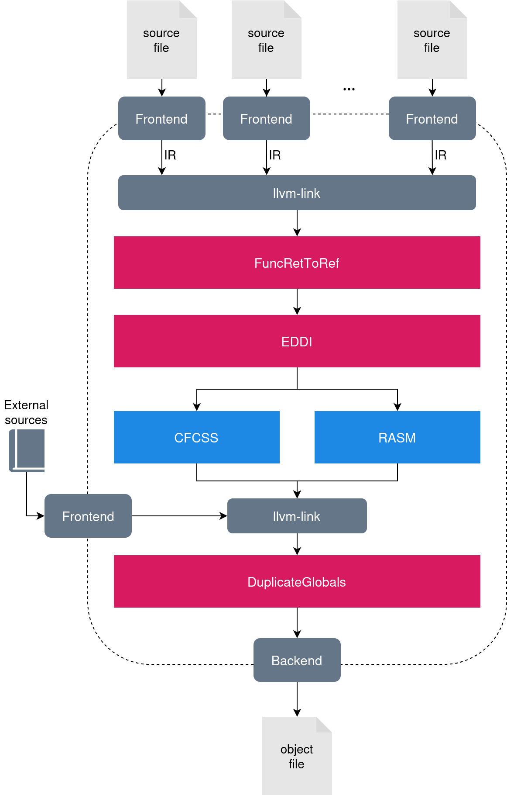

# ASPIS - Automatic Software-based Protection and Integrity Suite

ASPIS (from the ancient Greek Ἀσπίς Aspís, *shield*) is an out-of-tree plugin for LLVM that acts on the Intermediate-Representation (IR) in order to harden the code against Single-Event Upsets (SEUs). 

The hardening process is done by the sequence of passes depicted in the following figure:
<p align=center>

</p>

## Pre-requisites

The toolchain has been tested with the following versions:
- CMake 3.22.1
- LLVM 16.0.0

During the development of ASPIS, done mostly on LLVM 15, we discovered a bug in the [`splitBasicBlock()`](https://llvm.org/doxygen/classllvm_1_1BasicBlock.html#a2bc5caaabd6841e4ab97237ebcaeb86d) procedure. The bug has been fixed in LLVM 16, so we recommend using it rather than applying the patch to the previous versions. 

## Building

To build ASPIS, type the following commands:

```bash
mkdir build
cmake -B build -DLLVM_DIR=<your/llvm/dir>
cmake --build build
```

Where `your/llvm/dir` is the directory where LLVMConfig.cmake is found (check here [here](https://llvm.org/docs/CMake.html) for further information).

# Usage

In order to apply ASPIS, you can use the built-in compilation pipeline provided by the `aspis.sh` shell script, or you can make your own custom compilation pipeline using LLVM `opt`.

## Annotations

When compiling `C`/`C++`, it is possible to use clang annotations in the source to manually tell the compiler what to do with specific variables and/or functions. The syntax for the annotation is the following:

```C
__attribute__((annotate(<annotation>)))
```

The following describes the possibilities for `<annotation>`.

### The `recursive_protection` annotation

```C
__attribute__((annotate("recursive_protection")))
```

When a function is declared this way, ASPIS Recursively protects this resource. If the annotation is applied to a function, all the function body is protected and recursively all the called functions are duplicated (for exception of the `exclude` functions).

### The `to_duplicate` annotation

```C
__attribute__((annotate("to_duplicate")))
```

When a function is declared this way, ASPIS does not duplicate the function body, but duplicates the call to the function.

When a global variable outside the compilation unit is declared this way, ASPIS duplicates it.


### The `exclude` annotation

```C
__attribute__((annotate("exclude")))
```
ASPIS does not compile the annotated function or does not duplicate the annotated global variable.
All its content is not duplicated, for exception of the protected global variables (way to enter in the sphere of replication).

### General behaviour of REDDI

All aliases are "solved" (aliases substituted with aliasees).
All the `volatile` global variables are treated like `excluded` GV.

We mark the resources to protect with the `recursive_protection` annotation and the resources that shouldn't be protected with the `exclude` annotation. In the middle there is the grey-area, with the rest of resources that are not marked at all. 
First of all, recursively all the resources and their dependencies are protected, leading to an expansion of the sphere of replication.
The most critical and non trivial transformations are the ones in the edges of the two spheres: when we have to go from the protected part to the excluded part and vice-versa.
When all the duplication path is computed and protected, all the fixups will be done to generate coherent code, avoiding to call malformed functions.

All uses of the `recursive_protection` global variables are duplicated:
- In `exclude` functions, all operations are duplicated for both the GV or only the stores are duplicated?.
    - If called a `recursive_protection` function: TBD (see Case 1) [ENTER IN SPHERE OF REPLICATION]
    - If called a `to_duplicate` function: called two times for both the GV.
    - If called a `exclude` function: called two times for both the GV.
    - If called a grey-area funciton: TBD
- In `to_duplicate` functions, all operations are duplicated for both the GV (Case 3).
    - TBD
- In grey-area and in `recursive_protection` functions, all operations are duplicated for both the GV.
    - If called a `recursive_protection` function: TBD (see Case 1) 
    - If called a `to_duplicate` function: called two times, one for first GV and one for the duplicated one.
    - If called a `exclude` function: called two times for both the GV. [EXIT FROM SPHERE OF REPLICATION]
    - If called a grey-area funciton: TBD

### Bad particular cases
#### Case 1
What if it is called a `recursive_protection` with two parameters where the first is a `recursive_protection` GV and the other is an `exclude` GV.

Solution 1:
Creating an alternative where is duplicated only the parameter to duplicate but not the others.
CON: Potentially could lead to GREAT increment of binary size
PRO: Correct solution, without other assumptions

Solution 2:
Creating only one "_dup" function, but with flags to enable duplication of each input parameter and its relative checks.
CON: Could lead to a higher overhead when sanity checking (runtime execution)
PRO: Correct solution, without other assumptions. Just a small increment of spatial overhead wrt the previous EDDI method.

Solution 3:
Assert that this isn't a possible option
CON: Great and incorrect assumption
PRO: Code a lot easier

#### Case 1.1
What if it is called a `recursive_protection` with two parameters where the first one is a `recursive_protection` GV and the other is in the grey-area.

Solution: Use the `_dup` version.

#### Case 1.2
What if it is called a `recursive_protection` with two parameters where the first one is an `exclude` GV and the other is in the grey-area.

Solution: Use the `_original` version.

#### Case 2
How to handle the usage of a pointer to a `recursive_protection`?

Solution 1:
The Solution 2 of Case 1 could be useful for this case too. We could enable the protection of the parameters depending if the passed parameter is duplicated or not in the calling function.

#### Case 3
How to handle the usage of `recursive_protection` GV inside `to_duplicate` functions?

e.g.
```C
int counter __attribute__((annotate("recursive_protection")));

void malloc(int size) __attribute__((annotate("to_duplicate")))
{
    counter += size;
}

int main()
{
    counter = 0;
    malloc(10);
}
```
Transformed in:
```C
int counter;
int counter_dup;

void malloc(int size) __attribute__((annotate("to_duplicate")))
{
    counter += size;
    counter_dup += size;
}

int main()
{
    counter = 0;
    counter_dup = 0;
    malloc(10);
    malloc(10);
}

```

Solution:
Duplicate usages of GV.

## Built-in compilation pipeline
`aspis.sh` is a simple command-line interface that allows users to run the entire compilation pipeline specifying a few command-line arguments. The arguments that are not recognised are passed directly to the front-end, hence all the `clang` arguments are admissible.

### Options
 - `-h`, `--help`: Display available options.
 - `-o <file>`: Write the compilation output to `<file>`.
 - `--llvm-bin <path>`: Set the path to the llvm binaries (clang, opt, llvm-link) to `<path>`.
 - `--exclude <file>`: Set the files to exclude from the compilation. The content of `<file>` is the list of files to exclude, one for each line (wildcard `*` allowed).
 - `--asmfiles <file>`: Defines the set of assembly files required for the compilation. The content of `<file>` is the list of assembly files to pass to the linker at compilation termination, one for each line (wildcard `*` allowed).

### Hardening
 - `--eddi`: **(Default)** Enable EDDI.
 - `--seddi`: Enable Selective-EDDI.
 - `--fdsc`: Enable Full Duplication with Selective Checking.

 - `--cfcss`: **(Default)** Enable CFCSS.
 - `--rasm`: Enable RASM.
 - `--inter-rasm`: Enable inter-RASM with the default signature `-0xDEAD`.

### Example

Sample `excludefile.txt` content:

```
dir/of/excluded/files/*.c
file_to_esclude.c
```

Sample `asmfiles.txt` content:
```
dir/of/asm/files/*.s
asmfile_to_link.s
```

Compile the files `file1.c`, `file2.c`, and `file3.c` as:

```bash
./aspis.sh --llvm-bin your/llvm/bin/ --exclude excludefile.txt --asmfiles asmfiles.txt --seddi --rasm file1.c file2.c file3.c -o <out_filename>.c
```

## Create a custom compilation pipeline
Once ASPIS has been built, you can apply the passes using `opt`.

The compiled passes can be found as shared object files (`.so`) into the `build/passes` directory, and are described in the following. In order to apply the optimization, you must use LLVM  `opt` to load the respective shared object file.

### Data protection
Developers can select one of the following passes for data protection using the `-eddi-verify` flag:

- `libEDDI.so` with the `-eddi-verify` flag is the implementation of EDDI in LLVM;
- `libFDSC.so` with the `-eddi-verify` flag is the implementation of Full Duplication with Selective Checking, an extension of EDDI in which consistency checks are only inserted at basic blocks having multiple predecessors.
- `libSEDDI.so` with the `-eddi-verify` flag is the implementation of selective-EDDI (sEDDI), an extension of EDDI in which consistency checks are inserted only at `branch` and `call` instructions (no `store`).

Before and after the application of the `-eddi-verify` passes, developers must apply the `-func-ret-to-ref` and the `-duplicate-globals` passes, respectively.

### Control-Flow Checking
These are the alternative passes for control-flow checking:
- `libCFCSS.so` with the `-cfcss-verify` is the implementation of CFCSS in LLVM;
- `libRASM.so` with the `-rasm-verify` is the implementation of RASM in LLVM;
- `libINTER_RASM` with the `-rasm-verify` is the implementation of RASM that achieves inter-function CFC.

### Example of compilation with ASPIS (sEDDI + RASM)
First, compile the codebase with the appropriate front-end.

```bash
clang <files.c> -emit-llvm -S
```

The output files are IR files having an `.ll` extension. It is required to link them using `llvm-link` as follows:

```bash
llvm-link -S *.ll -o out.ll
```

Now, `out.ll` is a huge `.ll` file containing all the IR of the code passed through the clang frontend. The `out.ll` file is then transformed by our passes in the following order:

- FuncRetToRef
- sEDDI
- RASM
- DuplicateGlobals

With the addition of some built-in LLVM passes (`lowerswitch` and `simplifycfg`).

Run the following:

```bash
opt -lowerswitch out.ll -o out.ll
opt --enable-new-pm=0 -S -load </path/to/ASPIS/>build/passes/libEDDI.so -func-ret-to-ref out.ll -o out.ll
opt --enable-new-pm=0 -S -load </path/to/ASPIS/>build/passes/libSEDDI.so -eddi-verify out.ll -o out.ll
opt -passes=simplifycfg out.ll -o out.ll
opt --enable-new-pm=0 -S -load </path/to/ASPIS/>build/passes/libRASM.so -rasm-verify out.ll -o out.ll
```
You may also want to include other files in the compilation, that are previously excluded because of some architecture-dependent features. This is done with the following commands, which first remove the previously emitted single `.ll` files, then compile the excluded code and link it with the hardened code:

```bash
mv out.ll out.ll.bak
rm *.ll
clang <excluded_files.c> -emit-llvm -S
llvm-link -S *.ll out.ll.bak -o out.ll
```

Then, apply the last pass and emit the executable: 

```bash
opt --enable-new-pm=0 -S -load </path/to/ASPIS/>build/passes/libEDDI.so -duplicate-globals out.ll -o out.ll
clang out.ll -o out.elf
```
